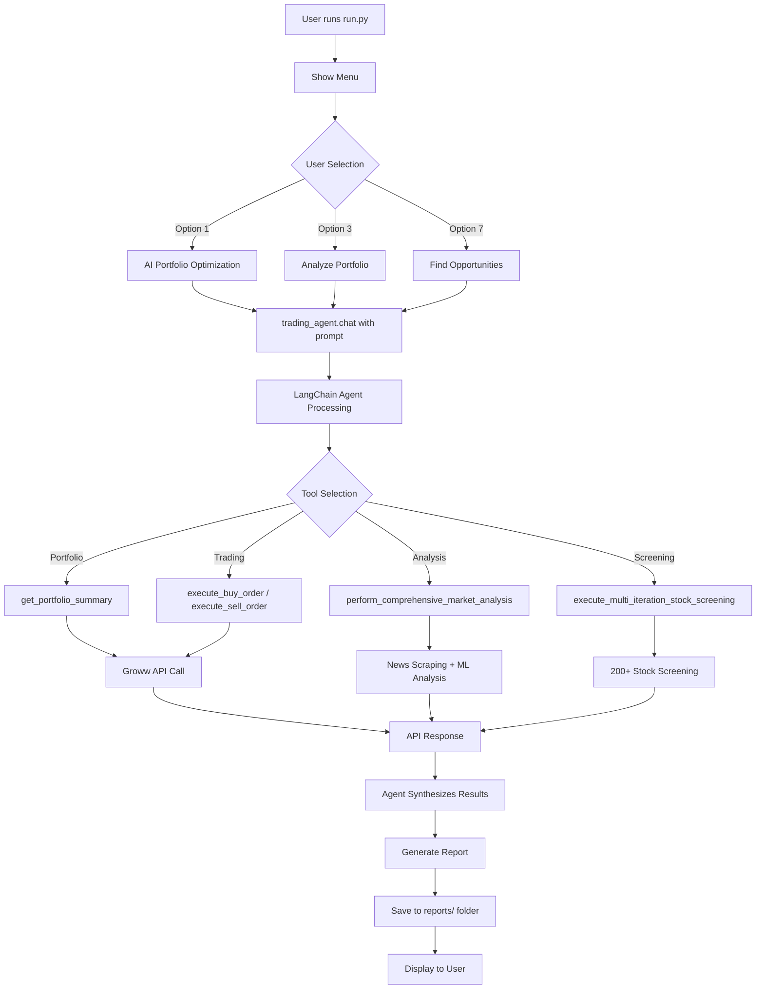

# 🤖 GitHub Copilot Instructions - AI Stock Trading Agent

> **Purpose**: This document provides comprehensive guidance for GitHub Copilot when working with this AI-powered stock trading agent codebase. It covers architecture, flows, patterns, and best practices.

---

## 📋 Table of Contents

1. [Project Overview](#project-overview)
2. [Architecture & Design Patterns](#architecture--design-patterns)
3. [Project Structure](#project-structure)
4. [Authentication Flow](#authentication-flow)
5. [Trading Agent Flow](#trading-agent-flow)
6. [Key Components](#key-components)
7. [Development Guidelines](#development-guidelines)
8. [Common Patterns](#common-patterns)
9. [Testing & Debugging](#testing--debugging)
10. [Security Considerations](#security-considerations)

---

## 🎯 Project Overview

### What This Project Does

This is an **AI-powered automated stock trading agent** for the Indian stock market using:
- **Groww APIs** for real-time trading and portfolio management
- **OpenAI GPT-4o** for intelligent trading decisions
- **LangChain** for AI agent orchestration
- **Python 3.13** with modern async patterns

### Core Capabilities

1. **Automated Trading**: AI-driven buy/sell decisions with risk management
2. **Portfolio Analysis**: Comprehensive analysis of current holdings
3. **Market Intelligence**: Real-time news sentiment from multiple Indian financial sources
4. **Stock Screening**: ML-powered screening of 200+ stocks
5. **Custom Strategies**: Natural language trading commands
6. **Portfolio Rebalancing**: Automated diversification and optimization

### Current Status

- **AI Model**: GPT-4o (128K context, 16K max_tokens)
- **Authentication**: Dual support (OAuth Token + TOTP)
- **Repository**: vibhorgoyal18/groww-stocks-agent
- **Branch**: feature/totp-authentication (latest), main (stable)

---

## 🏗️ Architecture & Design Patterns

### High-Level Architecture

```
┌─────────────────────────────────────────────────────────────┐
│                     User Interface Layer                     │
│  (run.py - Interactive Menu / CLI Commands)                 │
└──────────────────────┬──────────────────────────────────────┘
                       │
┌──────────────────────▼──────────────────────────────────────┐
│                   Agent Orchestration Layer                  │
│  (agent/trading_agent.py - LangChain Agent)                 │
│  - GPT-4o for decision making                               │
│  - Tool selection and execution                             │
│  - Natural language processing                              │
└──────────────────────┬──────────────────────────────────────┘
                       │
┌──────────────────────▼──────────────────────────────────────┐
│                     Tools & Services Layer                   │
│  ┌────────────────┬─────────────────┬──────────────────┐   │
│  │  Trading Tools │  Analysis Tools │  Data Sources    │   │
│  │  - groww_api   │  - screener     │  - News APIs     │   │
│  │  - execution   │  - ML models    │  - Market data   │   │
│  └────────────────┴─────────────────┴──────────────────┘   │
└──────────────────────┬──────────────────────────────────────┘
                       │
┌──────────────────────▼──────────────────────────────────────┐
│                   External Services Layer                    │
│  - Groww API (Trading & Portfolio)                          │
│  - OpenAI API (GPT-4o)                                      │
│  - News Sources (MoneyControl, ET, LiveMint, BS)           │
└─────────────────────────────────────────────────────────────┘
```

### Design Patterns Used

1. **Agent Pattern**: LangChain agent with tool-based architecture
2. **Strategy Pattern**: Configurable trading strategies via .env
3. **Factory Pattern**: Authentication method selection
4. **Singleton Pattern**: Configuration settings (Pydantic)
5. **Decorator Pattern**: Secure API key handling
6. **Observer Pattern**: Logging and monitoring

---

## 📁 Project Structure

```
groww_stocks_agent/
│
├── 🎮 ENTRY POINTS
│   ├── run.py                      # 🌟 PRIMARY: Interactive menu (9 options)
│   ├── ai_trading_agent.py         # Direct AI portfolio optimization
│   ├── main.py                     # Original CLI with parameters
│   └── scheduler.py                # Automated scheduling
│
├── 🤖 AGENT LAYER
│   └── agent/
│       ├── __init__.py
│       └── trading_agent.py        # Core LangChain agent (GPT-4o)
│           - TradingAgent class
│           - chat() method for flexible interactions
│           - Tool orchestration
│
├── 🔧 TOOLS LAYER
│   └── tools/
│       ├── __init__.py
│       ├── groww_api.py            # 🔑 Groww API client wrapper
│       ├── trading_tools.py        # Core trading operations (buy/sell/portfolio)
│       ├── advanced_trading_tools.py # Enhanced LangChain tools
│       ├── comprehensive_screener.py # 200+ stock screening
│       ├── stock_analysis.py       # ML-based technical analysis
│       ├── enhanced_analysis.py    # Market intelligence
│       ├── web_analysis.py         # News scraping
│       └── browser_tools.py        # Browser automation
│
├── ⚙️ CONFIGURATION LAYER
│   └── config/
│       ├── __init__.py
│       └── settings.py             # Pydantic settings (all env vars)
│           - Settings class with validation
│           - Type hints for all config
│
├── 🔐 UTILITIES LAYER
│   └── utils/
│       ├── __init__.py
│       ├── groww_auth.py           # 🆕 Authentication utility
│       │   - GrowwAuthenticator class
│       │   - Token + TOTP methods
│       └── security.py             # Secure API key handling
│
├── 📊 OUTPUT & REPORTS
│   └── reports/
│       ├── *.md                    # Markdown analysis reports
│       ├── *.csv                   # CSV data exports
│       ├── *.json                  # JSON execution logs
│       └── archive/                # Historical reports
│
├── 📝 CONFIGURATION FILES
│   ├── .env                        # 🔑 Environment variables (NOT in git)
│   ├── .env.example                # Template for .env
│   ├── requirements.txt            # Python dependencies
│   ├── .gitignore                  # Git exclusions
│   └── copilot-instructions.md     # This file
│
└── 📚 DOCUMENTATION
    └── README.md                   # User-facing documentation
```

### File Responsibilities

| File | Purpose | Key Functions |
|------|---------|---------------|
| **run.py** | Unified interactive entry point | `show_menu()`, `run_portfolio_analysis()`, `run_portfolio_rebalancing()` |
| **agent/trading_agent.py** | LangChain agent orchestration | `chat()`, `analyze_market_opportunities()`, `_create_agent()` |
| **tools/groww_api.py** | Groww API wrapper | `get_portfolio()`, `place_order()`, `get_positions()`, `_setup_auth()` |
| **utils/groww_auth.py** | Authentication management | `authenticate()`, `_authenticate_with_totp()`, `_authenticate_with_token()` |
| **config/settings.py** | Configuration management | `Settings` class with all env variables |
| **tools/comprehensive_screener.py** | Stock screening engine | `screen_stocks()`, `_analyze_stock()`, `_get_ml_predictions()` |

---

## 🔐 Authentication Flow

### Dual Authentication Support

The system supports **two authentication methods** for Groww API:

#### 1. OAuth 2.0 Token Method

```python
# Flow:
.env: GROWW_AUTH_METHOD=token
      GROWW_API_TOKEN=eyJ...

↓

config/settings.py: Settings.groww_auth_method = "token"
                   Settings.groww_api_token = "eyJ..."

↓

utils/groww_auth.py: GrowwAuthenticator.authenticate()
                    → _authenticate_with_token()
                    → Returns token directly

↓

tools/groww_api.py: GrowwAPIClient.__init__()
                   → _setup_auth()
                   → Creates GrowwAPI(access_token)

↓

Ready for trading operations
```

**Characteristics:**
- ✅ Quick setup
- ❌ Requires daily approval in Groww app
- ❌ Token expires after approval period
- 🔗 Generate: https://groww.in/trade-api/api-keys

#### 2. TOTP Method (Recommended)

```python
# Flow:
.env: GROWW_AUTH_METHOD=totp
      GROWW_TOTP_TOKEN=eyJ...
      GROWW_TOTP_SECRET=3FI4HAR...

↓

config/settings.py: Settings.groww_auth_method = "totp"
                   Settings.groww_totp_token = "eyJ..."
                   Settings.groww_totp_secret = "3FI4HAR..."

↓

utils/groww_auth.py: GrowwAuthenticator.authenticate()
                    → _authenticate_with_totp()
                    → pyotp.TOTP(secret).now() generates 6-digit code
                    → GrowwAPI.get_access_token(api_key=token, totp=code)
                    → Returns access_token

↓

tools/groww_api.py: GrowwAPIClient.__init__()
                   → _setup_auth()
                   → Creates GrowwAPI(access_token)

↓

Ready for trading operations (no expiry!)
```

**Characteristics:**
- ✅ No expiry
- ✅ No daily approvals
- ✅ More secure
- ✅ Can use authenticator apps
- 🔗 Generate: https://groww.in/trade-api/api-keys → "Generate TOTP token"

### Authentication Code Example

```python
# utils/groww_auth.py
from pyotp import TOTP
from growwapi import GrowwAPI

class GrowwAuthenticator:
    def _authenticate_with_totp(self) -> str:
        # Get credentials from settings
        totp_token = settings.groww_totp_token
        totp_secret = settings.groww_totp_secret
        
        # Generate time-based 6-digit code
        totp = TOTP(totp_secret)
        current_code = totp.now()  # e.g., "123456"
        
        # Get access token from Groww
        access_token = GrowwAPI.get_access_token(
            api_key=totp_token,
            totp=current_code
        )
        
        return access_token

# Helper function for easy usage
def get_authenticated_groww_client() -> GrowwAPI:
    authenticator = GrowwAuthenticator()
    access_token = authenticator.authenticate()
    return GrowwAPI(access_token=access_token)
```

---

## 🔄 Trading Agent Flow

### Complete Execution Flow



### Key Method: `trading_agent.chat()`

This is the **primary interface** for all agent interactions:

```python
# Example usage from run.py
response = trading_agent.chat(
    f"""Analyze my current portfolio and provide:
    1. Current holdings summary
    2. Performance analysis
    3. Risk assessment
    4. Recommendations for improvement
    
    Target return: {settings.min_expected_return}% in {settings.expected_return_days} days
    """
)
```

**Why use `.chat()` instead of specific methods?**
- ✅ Flexible: Handles any natural language request
- ✅ Agent-driven: AI selects appropriate tools
- ✅ Composable: Can combine multiple operations
- ✅ Future-proof: Works with new tools automatically

### Tool Execution Pattern

```python
# In tools/trading_tools.py
from langchain.tools import tool

@tool
def get_portfolio_summary(query: str = "summary") -> dict:
    """Get summary of current portfolio holdings.
    
    Args:
        query: Type of summary (summary/detailed/performance)
        
    Returns:
        dict with portfolio data
    """
    try:
        groww_client = GrowwAPIClient()
        portfolio = groww_client.get_portfolio()
        # Process and return
        return portfolio
    except Exception as e:
        logger.error(f"Portfolio fetch failed: {e}")
        raise
```

---

## 🔑 Key Components

### 1. TradingAgent Class

**Location**: `agent/trading_agent.py`

```python
class TradingAgent:
    """AI Trading Agent for automated stock trading."""
    
    def __init__(self):
        self.llm = self._initialize_llm()      # GPT-4o
        self.agent = self._create_agent()       # LangChain agent
    
    def chat(self, message: str) -> str:
        """Primary interface for all interactions."""
        pass
    
    def analyze_market_opportunities(self, 
                                    target_return: float,
                                    time_horizon: int,
                                    budget: float) -> dict:
        """Structured market analysis."""
        pass
```

**Configuration:**
- Model: `gpt-4o` (128K context window)
- Max Tokens: 16,384
- Temperature: 0.7 (balanced creativity/precision)
- Tools: All tools from `tools/trading_tools.py`

### 2. GrowwAPIClient Class

**Location**: `tools/groww_api.py`

```python
class GrowwAPIClient:
    """Wrapper for Groww API with authentication."""
    
    def __init__(self):
        self.api = self._setup_auth()
    
    def _setup_auth(self) -> GrowwAPI:
        """Setup authentication using new utility."""
        try:
            # New authentication method
            from utils.groww_auth import get_authenticated_groww_client
            return get_authenticated_groww_client()
        except ImportError:
            # Fallback to legacy token method
            return GrowwAPI(access_token=settings.groww_api_token)
    
    # Trading methods
    def place_order(self, symbol, quantity, side, order_type, price=None) -> dict
    def get_portfolio(self) -> dict
    def get_positions(self) -> list
    def cancel_order(self, order_id: str) -> bool
```

### 3. GrowwAuthenticator Class

**Location**: `utils/groww_auth.py`

```python
class GrowwAuthenticator:
    """Handle Groww API authentication."""
    
    def __init__(self):
        self.access_token = None
        self.auth_method = settings.groww_auth_method
    
    def authenticate(self) -> str:
        """Authenticate using configured method."""
        if self.auth_method == "totp":
            return self._authenticate_with_totp()
        elif self.auth_method == "token":
            return self._authenticate_with_token()
    
    def refresh_token(self) -> str:
        """Refresh the access token."""
        return self.authenticate()
    
    def get_groww_client(self) -> GrowwAPI:
        """Get authenticated GrowwAPI instance."""
        token = self.authenticate()
        return GrowwAPI(access_token=token)
```

### 4. Settings Class

**Location**: `config/settings.py`

```python
from pydantic_settings import BaseSettings

class Settings(BaseSettings):
    """Application settings from environment variables."""
    
    # OpenAI
    openai_api_key: str
    
    # Groww Authentication
    groww_auth_method: str = "token"  # "token" or "totp"
    groww_api_token: str = ""
    groww_totp_token: str = ""
    groww_totp_secret: str = ""
    
    # Trading Strategy
    max_investment_amount: float = 10000.0
    risk_threshold: float = 0.20
    min_expected_return: float = 15.0
    expected_return_days: int = 30
    
    # System
    log_level: str = "INFO"
    
    class Config:
        env_file = ".env"
        case_sensitive = False

settings = Settings()  # Singleton instance
```

---

## 💻 Development Guidelines

### Code Style & Standards

1. **Type Hints**: Always use type hints
   ```python
   def analyze_stock(symbol: str, timeframe: int = 30) -> dict[str, Any]:
       pass
   ```

2. **Docstrings**: Google-style docstrings
   ```python
   def execute_trade(symbol: str, quantity: int) -> dict:
       """Execute a trade order.
       
       Args:
           symbol: Stock symbol (e.g., "RELIANCE")
           quantity: Number of shares
           
       Returns:
           dict: Order confirmation with order_id, status, etc.
           
       Raises:
           ValueError: If symbol is invalid
           RuntimeError: If order execution fails
       """
   ```

3. **Error Handling**: Specific exceptions with context
   ```python
   try:
       result = api_call()
   except APIError as e:
       logger.error(f"API call failed for {symbol}: {e}", exc_info=True)
       raise RuntimeError(f"Failed to fetch {symbol}: {e}") from e
   ```

4. **Logging**: Structured logging at appropriate levels
   ```python
   logger.info(f"Starting portfolio analysis for user {user_id}")
   logger.debug(f"Portfolio data: {portfolio}")
   logger.warning(f"High risk detected: {risk_score}")
   logger.error(f"Trade execution failed: {error}", exc_info=True)
   ```

### Environment Variables

**Always add new env vars to:**
1. `.env` file with documentation
2. `.env.example` template
3. `config/settings.py` Settings class
4. `README.md` configuration section

**Example:**
```python
# .env
# New feature configuration
NEW_FEATURE_ENABLED=true
NEW_FEATURE_TIMEOUT=30

# config/settings.py
class Settings(BaseSettings):
    new_feature_enabled: bool = False
    new_feature_timeout: int = 30
```

### Adding New Tools

**Pattern for LangChain tools:**

```python
# tools/new_feature_tools.py
from langchain.tools import tool
import logging

logger = logging.getLogger(__name__)

@tool
def new_trading_tool(param: str) -> dict:
    """Short description for AI to understand when to use this tool.
    
    Args:
        param: Description of parameter
        
    Returns:
        dict: Description of return value
    """
    try:
        logger.info(f"Executing new_trading_tool with {param}")
        
        # Implementation
        result = do_something(param)
        
        logger.info("Tool execution successful")
        return {"success": True, "data": result}
        
    except Exception as e:
        logger.error(f"Tool execution failed: {e}", exc_info=True)
        return {"success": False, "error": str(e)}

# Add to tools/trading_tools.py
from tools.new_feature_tools import new_trading_tool
trading_tools = [
    # ... existing tools
    new_trading_tool,
]
```

### Testing Pattern

```python
# tests/test_new_feature.py
import pytest
from tools.new_feature_tools import new_trading_tool

def test_new_trading_tool_success():
    """Test successful tool execution."""
    result = new_trading_tool("valid_param")
    assert result["success"] is True
    assert "data" in result

def test_new_trading_tool_error():
    """Test error handling."""
    result = new_trading_tool("invalid_param")
    assert result["success"] is False
    assert "error" in result
```

---

## 🎨 Common Patterns

### 1. Secure API Key Access

**NEVER expose API keys to the AI:**

```python
# ✅ CORRECT
from utils.security import get_secure_api_key

@tool
def some_tool() -> dict:
    """Tool description."""
    api_key = get_secure_api_key()  # Not visible to AI
    result = api_call(api_key)
    return result

# ❌ WRONG
@tool
def some_tool(api_key: str) -> dict:  # Never pass as parameter!
    """Tool description."""
    result = api_call(api_key)
    return result
```

### 2. Error Recovery Pattern

```python
from typing import Optional
import time

def api_call_with_retry(
    func: callable,
    max_retries: int = 3,
    backoff: float = 1.0
) -> Optional[dict]:
    """Execute API call with exponential backoff retry."""
    for attempt in range(max_retries):
        try:
            return func()
        except APIRateLimitError as e:
            if attempt == max_retries - 1:
                raise
            wait_time = backoff * (2 ** attempt)
            logger.warning(f"Rate limited, retrying in {wait_time}s")
            time.sleep(wait_time)
        except APITemporaryError as e:
            if attempt == max_retries - 1:
                raise
            logger.warning(f"Temporary error, retrying: {e}")
            time.sleep(backoff)
    return None
```

### 3. Report Generation Pattern

```python
from datetime import datetime
import os

def save_report(content: str, report_type: str) -> str:
    """Save report to reports/ directory with timestamp."""
    timestamp = datetime.now().strftime("%Y%m%d_%H%M%S")
    filename = f"{report_type}_{timestamp}.md"
    filepath = os.path.join("reports", filename)
    
    os.makedirs("reports", exist_ok=True)
    with open(filepath, "w") as f:
        f.write(content)
    
    logger.info(f"Report saved: {filepath}")
    return filepath
```

### 4. Configuration Access Pattern

```python
# ✅ CORRECT - Use settings singleton
from config.settings import settings

def some_function():
    max_amount = settings.max_investment_amount
    risk = settings.risk_threshold

# ❌ WRONG - Don't access os.environ directly
import os
def some_function():
    max_amount = float(os.getenv("MAX_INVESTMENT_AMOUNT"))
```

---

## 🧪 Testing & Debugging

### Running the Application

```bash
# 1. Interactive menu (recommended)
python run.py

# 2. Direct AI optimization
python ai_trading_agent.py

# 3. Demo mode (no real trades)
python demo_enhanced_screening.py

# 4. Original CLI
python main.py --action analyze_portfolio
```

### Debugging Tips

1. **Check Logs**: All operations logged to `trading_agent.log`
   ```bash
   tail -f trading_agent.log
   ```

2. **Verify Authentication**:
   ```python
   python -c "from utils.groww_auth import get_authenticated_groww_client; print(get_authenticated_groww_client())"
   ```

3. **Test Individual Tools**:
   ```python
   python -c "from tools.groww_api import GrowwAPIClient; client = GrowwAPIClient(); print(client.get_portfolio())"
   ```

4. **Validate Configuration**:
   ```python
   python -c "from config.settings import settings; print(settings.dict())"
   ```

5. **Increase Logging**:
   ```bash
   # In .env
   LOG_LEVEL=DEBUG
   ```

### Common Issues & Solutions

| Issue | Cause | Solution |
|-------|-------|----------|
| `No module named 'pyotp'` | Missing dependency | `pip install -r requirements.txt` |
| `OpenAI API key is required` | Missing OPENAI_API_KEY | Add to .env file |
| `Authentication failed` | Invalid credentials | Regenerate from Groww portal |
| `Context length exceeded` | Prompt too long | Using gpt-4o (128K context) |
| `Rate limit exceeded` | Too many API calls | Implement backoff/retry |

---

## 🔒 Security Considerations

### Critical Security Rules

1. **NEVER commit `.env` file** - Already in `.gitignore`
2. **NEVER expose API keys to AI models** - Use `utils/security.py`
3. **NEVER log sensitive data** - Mask tokens in logs
4. **ALWAYS validate user input** - Sanitize before API calls
5. **ALWAYS use HTTPS** - All API calls encrypted

### Secure Coding Patterns

```python
# ✅ Secure logging
logger.info(f"Authenticated user: {user_id}")  # OK
logger.debug(f"Token: {token[:8]}...")  # Masked

# ❌ Insecure logging
logger.info(f"API Token: {token}")  # NEVER!

# ✅ Secure error messages
return {"error": "Authentication failed"}

# ❌ Insecure error messages
return {"error": f"Invalid token: {token}"}  # Exposes token!
```

### API Key Rotation

When rotating API keys:
1. Generate new credentials from Groww portal
2. Update `.env` file
3. Restart application
4. Verify authentication works
5. Revoke old credentials

---

## 📊 Performance Optimization

### Best Practices

1. **Cache Expensive Operations**:
   ```python
   from functools import lru_cache
   
   @lru_cache(maxsize=128)
   def get_stock_data(symbol: str) -> dict:
       """Cache stock data for 5 minutes."""
       return expensive_api_call(symbol)
   ```

2. **Batch API Calls**:
   ```python
   # ✅ Good - Single batch call
   symbols = ["RELIANCE", "TCS", "INFY"]
   data = api.get_quotes(symbols)
   
   # ❌ Bad - Multiple individual calls
   for symbol in symbols:
       data = api.get_quote(symbol)
   ```

3. **Async for I/O**:
   ```python
   import asyncio
   
   async def fetch_multiple_stocks(symbols: list) -> list:
       tasks = [fetch_stock(s) for s in symbols]
       return await asyncio.gather(*tasks)
   ```

---

## 🚀 Deployment Checklist

Before deploying:

- [ ] All tests pass
- [ ] `.env` configured correctly
- [ ] API credentials valid
- [ ] Logs reviewing (no sensitive data)
- [ ] Error handling tested
- [ ] Rate limits configured
- [ ] Backup strategy in place
- [ ] Monitoring setup
- [ ] Documentation updated

---

## 📝 Changelog & Version History

### v2.0.0 (Current - Nov 2025)
- ✅ Added TOTP authentication support
- ✅ Created `utils/groww_auth.py` authentication module
- ✅ Dual authentication method (Token + TOTP)
- ✅ Updated to GPT-4o (from gpt-4o-mini)
- ✅ Enhanced documentation

### v1.5.0
- ✅ Created unified entry point (`run.py`)
- ✅ Interactive menu system
- ✅ Upgraded to gpt-4o-mini (128K context)
- ✅ Fixed all TradingAgent method calls

### v1.0.0
- ✅ Initial release
- ✅ Basic trading functionality
- ✅ Portfolio analysis
- ✅ Stock screening

---

## 🤝 Contributing Guidelines

When contributing code:

1. **Follow the patterns** documented above
2. **Add tests** for new features
3. **Update documentation** (README, this file)
4. **Use type hints** and docstrings
5. **Handle errors** gracefully
6. **Log appropriately** (INFO for actions, DEBUG for details)
7. **Secure by default** (no exposed credentials)

---

## 📚 Additional Resources

- **Groww API Docs**: https://groww.in/trade-api/docs
- **LangChain Docs**: https://python.langchain.com/docs
- **OpenAI API Docs**: https://platform.openai.com/docs
- **PyOTP Docs**: https://pyauth.github.io/pyotp/

---

## 🆘 Getting Help

When GitHub Copilot needs clarification:

1. **Check this document first** - Most patterns documented
2. **Review existing code** - Look for similar implementations
3. **Check logs** - Error messages are descriptive
4. **Consult README.md** - User-facing documentation
5. **Ask specific questions** - Include context and error messages

---

**Last Updated**: November 11, 2025  
**Maintainer**: vibhorgoyal18  
**Repository**: vibhorgoyal18/groww-stocks-agent
